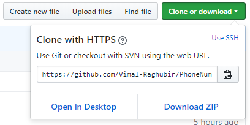
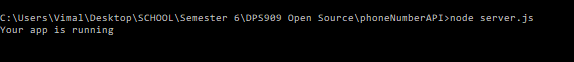
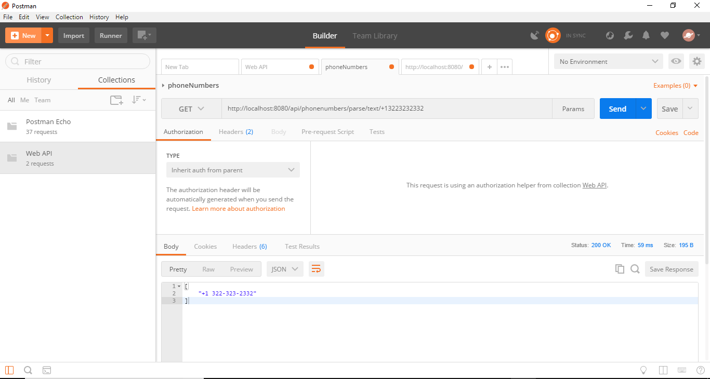
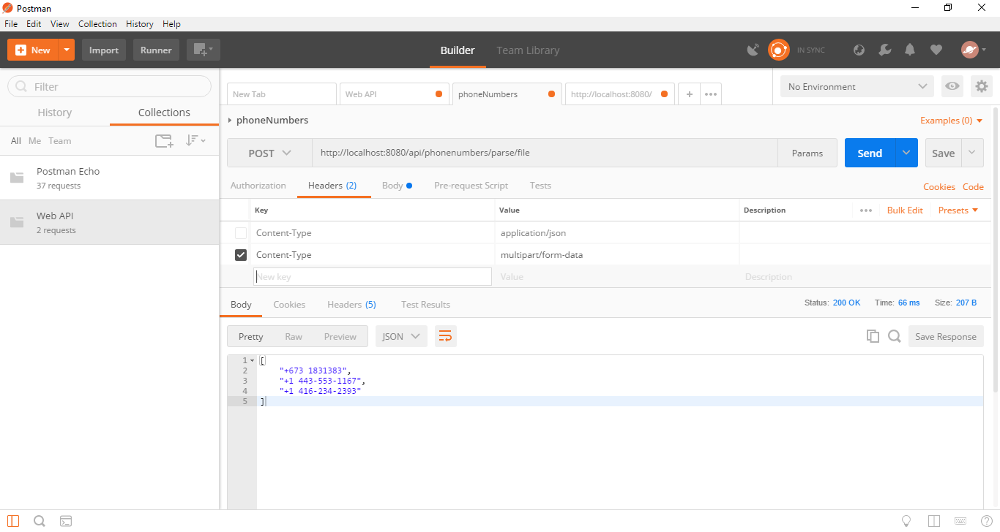
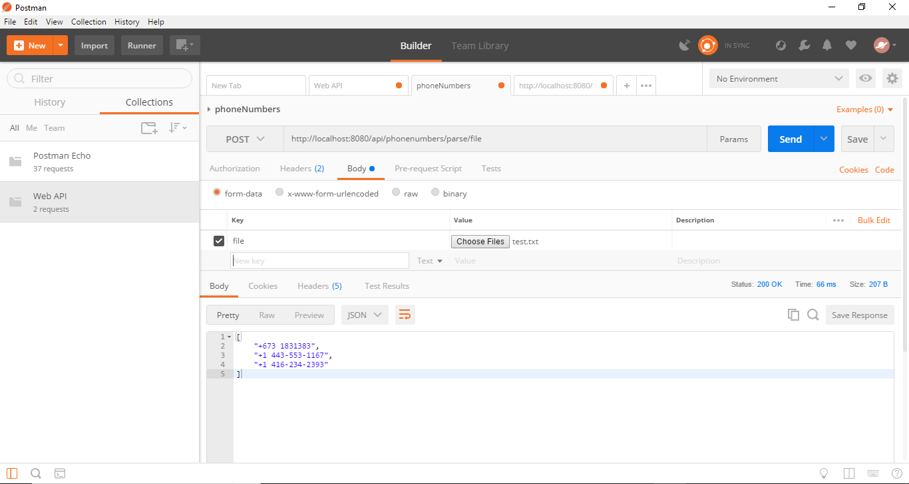
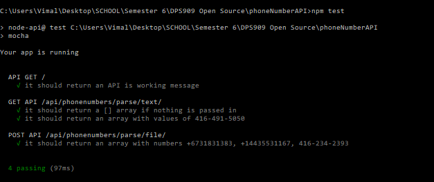

# PhoneNumberAPI
A phoneNumber parser that uses Google libphonenumber library for parsing numbers from a file and url. You must have
Node.js installed on your computer and you can do this by downloading a package from this website: https://nodejs.org/en/.

# Required before Running
Download this repository by following this: 



Open the command line and first write this command: 
```ch
npm install
```
And then run this code to start your server on the port 8080.
```ch
node server.js
```
The server will be running like this: 



To test the API endpoints GET and POST you must first download Postman application from here https://www.getpostman.com/.

## GET
To test GET request pass this in localhost:8080/api/phonenumbers/parse/text/+13223232332 as a tutorial for the GET request like the following screenshot below.
Also please remember to set the Content-Type of the request to application/json.



## POST
To test POST request localhost:8080/api/phonenumbers/parse/file and set the Content-Type of the request to multipart/form-data. Reference screenshots below for further detail.





# Running Tests
To run the tests go into the server and run the command node npm test like the screenshot below.



#HTML Interface
To use the HTML interface, go to Localhost:8080.


